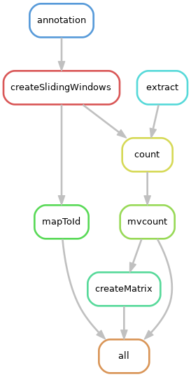

# Snakemake pipeline for htseq-clip  post processing

A [Snakemake](https://snakemake.readthedocs.io/en/stable/) pipeline for post-processing alignment files using [htseq-clip](https://pypi.org/project/htseq-clip/).

## Installation

* We recommend creating and using an exclusive [Anaconda](https://docs.anaconda.com/anaconda/install/index.html) enviroment for `htseq-clip`. 
* Install the latest of version of htseq-clip and Snakemake to the environment from pip.
## Config file
All the configurations to run this pipeline are defined in the `config.yaml` file available under this repository. You are encouraged to read through the file and make changes based on your experiment design. Some of the entries in the file are **intentionally left blank**, so please make sure to fill them before running the pipeline. Please note the following keywords in the file:

* **project:** complete path to the eCLIP project folder
* **gff:** complete path to gff3 annotation file
* **annotation:** the default parameters are for [Gencode](https://www.gencodegenes.org/) gff3 files, so make sure to change these if you have annotation files from a different source
* **createSlidingWindows:** for window and step size parameters
* **extract:** some of the parameters are intentionally left blank here, so please fill them up based on your experiment design

## Running pipeline
Run the snakemake pipline as

```bash
cd /path/to/eCLIP_project
snakemake --snakefile /path/to/htseq-clip_snakemake/Snakefile --configfile /path/to/edited/config.yaml  --cores 5
```
The default output file will be:  **`<project>/counts/combined_matrix_swcounts.txt`**

Pipeline DAG:



## Statistical analysis

The statistical analysis of the output count matrix can be done using [DEWSeq](https://bioconductor.org/packages/release/bioc/html/DEWSeq.html). The documentation and vignette are available in [Bioconductor repository page](https://bioconductor.org/packages/release/bioc/html/DEWSeq.html). 

### Parameterized Rmarkdown
A parameterized Rmarkdown for [DEWSeq analysis is also available](https://github.com/EMBL-Hentze-group/DEWSeq_analysis_helpers/tree/master/Parametrized_Rmd). For instructions on using this Rmd file, please see the README file in the repository.
